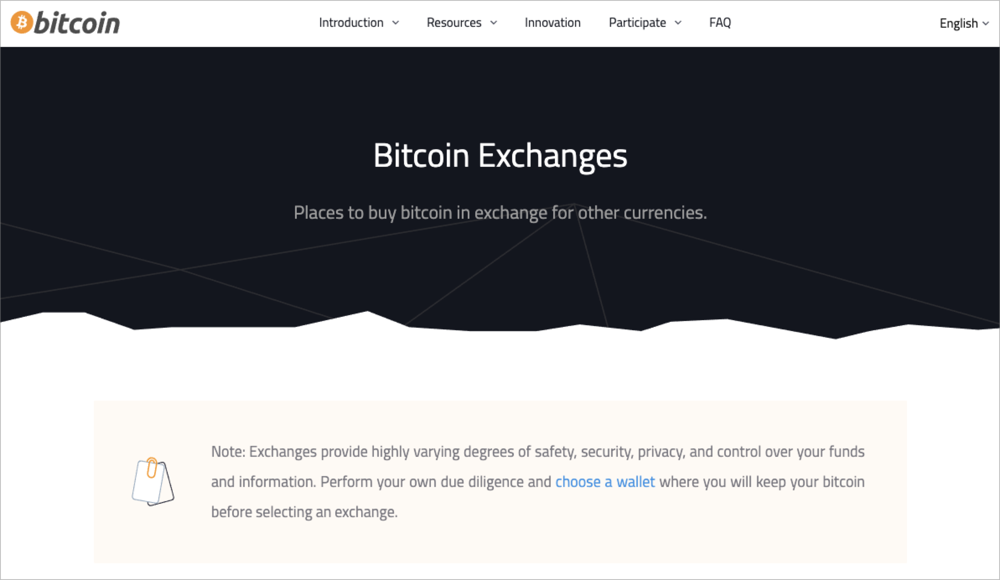

# Average Response Times for Bitcoin Exchanges

The repository weights the average customer support response time for 60+
bitcoin exchanges around the world. This research is made available to the
community though existing work done at [bitcoin.org](https://bitcoin.org/)
analyzing the quality of bitcoin exchanges.

This information is also available in a [Google Sheet](https://docs.google.com/spreadsheets/d/1k90K6aCj9MMQZjDoMbQsG5_B7MZ4YHkCg_gmtP1G_ag/edit?usp=sharing).

## Notes

+ A response time of 0 means that we received a reply the same day.
+ Proof of correspondence with each exchange is available in the [correspondence folder](https://github.com/wbnns/average-response-time-bitcoin-exchanges/tree/master/correspondence).

## Contact

Please contact [will@bitcoin.org](mailto:will@bitcoin.org) with any questions or
feedback.

## Average Response Times

| Name                | URL                                       | Service area   | Contact                                                                  | Last contacted | Response time in days | Previous response time in days (1) | Previous response time in days (2) | Average response time in days | 
|---------------------|-------------------------------------------|----------------|--------------------------------------------------------------------------|----------------|-----------------------|------------------------------------|------------------------------------|-------------------------------| 
| AnyCoin Direct      | https://anycoindirect.eu/                 | Europe         | support@anycoindirect.eu                                                 | 6/4/2020       | 1                     |                                    |                                    | 1.00                          | 
| ArgenBTC            | https://argenbtc.com/                     | Argentina      | contacto@argenbtc.com                                                    | 6/4/2020       | 0                     |                                    |                                    | 0.00                          | 
| Binance Jersey      | https://www.binance.je/en                 | Europe         | https://support.binance.je/hc/en-us/requests/new                         | 6/4/2020       | 1                     |                                    |                                    | 1.00                          | 
| Binance Singapore   | https://www.binance.sg/en                 | Singapore      | https://binancesingapore.zendesk.com/hc/en-us/requests/new               | 6/4/2020       | 1                     |                                    |                                    | 1.00                          | 
| Binance Uganda      | https://www.binance.co.ug/en              | Uganda         | https://support.binance.co.ug/hc/en-us/requests/new                      | 6/4/2020       | 1                     |                                    |                                    | 1.00                          | 
| bitbank             | https://www.bitbank.com/                  | Japan          | support@bitbank.com                                                      | 6/4/2020       | 1                     |                                    |                                    | 1.00                          | 
| BitBay              | https://bitbay.net/en                     | Poland         | https://support.bitbay.net/en/support/home                               | 6/4/2020       | 1                     |                                    |                                    | 1.00                          | 
| Bitbuy              | https://bitbuy.ca/                        | Canada         | https://support.bitbuy.ca/hc/en-us/requests/new                          | 6/4/2020       | 1                     |                                    |                                    | 1.00                          | 
| Bitcoin.de          | https://www.bitcoin.de/en                 | Europe         | https://www.bitcoin.de/en/kontakt                                        | 6/8/2020       | 0                     |                                    |                                    | 0.00                          | 
| Bitex               | https://bitex.la/                         | Argentina      | Icon in bottom right-hand corner of page                                 | 6/8/2020       | 11                    |                                    |                                    | 11.00                         | 
| bitFlyer            | https://bitflyer.com/                     | Worldwide      | https://bitflyer.com/en-eu/contact                                       | 6/8/2020       | 0                     |                                    |                                    | 0.00                          | 
| Bithumb             | https://www.bithumb.com/                  | South Korea    | info@bithumbcorp.com                                                     | 6/8/2020       | 5                     |                                    |                                    | 5.00                          | 
| BitOasis            | https://bitoasis.net/en/home              | Middle East    | https://bitoasis.net/en/support                                          | 6/4/2020       | 1                     |                                    |                                    | 1.00                          | 
| BitPanda            | https://www.bitpanda.com/en               | Europe         | https://support.bitpanda.com/hc/en-us/requests/new                       | 6/4/2020       | 1                     |                                    |                                    | 1.00                          | 
| Bitquick            | https://bitquick.co/                      | P2P            | https://bitquick.co/contact                                              | 6/4/2020       | 1                     |                                    |                                    | 1.00                          | 
| Bits of Gold        | https://www.bitsofgold.net/               | Israel         | https://bitsofgoldhelp.freshdesk.com/en/support/tickets/new              | 6/4/2020       | 3                     |                                    |                                    | 3.00                          | 
| Bitso               | https://bitso.com/                        | Mexico         | https://help.bitso.com/en/support/tickets/new                            | 6/4/2020       | 8                     |                                    |                                    | 8.00                          | 
| Bitstamp            | https://www.bitstamp.net/                 | Worldwide      | support@bitstamp.net                                                     | 6/4/2020       | 1                     |                                    |                                    | 1.00                          | 
| Bittrex             | https://global.bittrex.com/               | United States  | https://bittrexglobal.zendesk.com/hc/en-us/requests/new                  | 6/4/2020       | 1                     |                                    |                                    | 1.00                          | 
| Bittylicious        | https://bittylicious.com/                 | United Kingdom | support@bittylicious.com                                                 | 6/4/2020       | 1                     |                                    |                                    | 1.00                          | 
| Bitvavo             | https://bitvavo.com/en                    | Europe         | https://support.bitvavo.com/l/en                                         | 6/4/2020       | 1                     |                                    |                                    | 1.00                          | 
| BL3P                | https://bl3p.eu/                          | Europe         | contact@bl3p.eu                                                          | 6/4/2020       | 1                     |                                    |                                    | 1.00                          | 
| Brasil Bitcoin      | https://brasilbitcoin.com.br/             | Brazil         | suporte@brasilbitcoin.com.br                                             | 6/4/2020       | 1                     |                                    |                                    | 1.00                          | 
| Btcbox              | https://www.btcbox.co.jp/                 | Japan          | https://support.btcbox.co.jp/hc/en-us/requests/new                       | 6/4/2020       | 1                     |                                    |                                    | 1.00                          | 
| BTC Markets         | https://www.btcmarkets.net/               | Australia      | https://support.btcmarkets.net/hc/en-us/requests/new                     | Pending        | N/A                   |                                    |                                    | N/A                           | 
| Buda                | https://buda.com/                         | South America  | Icon in bottom right-hand corner of page                                 | 6/8/2020       | 0                     |                                    |                                    | 0.00                          | 
| Canadian Bitcoins   | https://www.canadianbitcoins.com/         | Canada         | info@canadianbitcoins.com                                                | 6/5/2020       | 0                     |                                    |                                    | 0.00                          | 
| Coinbase            | https://www.coinbase.com/                 | Worldwide      | https://help.coinbase.com/en/contact-us                                  | 6/8/2020       | 0                     |                                    |                                    | N/A                           | 
| Coinberry           | https://www.coinberry.com/                | Canada         | https://help.coinberry.com/s/                                            | 6/5/2020       | 0                     |                                    |                                    | N/A                           | 
| CoinCorner          | https://www.coincorner.com/               | United Kingdom | https://www.coincorner.com/ContactUs                                     | 6/5/2020       | 0                     |                                    |                                    | 0.00                          | 
| Coinfloor           | https://www.coinfloor.co.uk/              | United Kingdom | support@coinfloor.co.uk                                                  | 6/5/2020       | 4                     |                                    |                                    | 4.00                          | 
| CoinJar             | https://www.coinjar.com/au/               | Australia      | https://support.coinjar.com/hc/en-us/requests/new                        | 6/5/2020       | 3                     |                                    |                                    | 3.00                          | 
| Coinmama            | https://www.coinmama.com/                 | Worldwide      | https://support.coinmama.com/hc/en-us/requests/new?ticket_form_id=190869 | 6/5/2020       | 0                     |                                    |                                    | 0.00                          | 
| Coinone             | https://coinone.co.kr/                    | South Korea    | support@coinone.co.kr                                                    | 6/8/2020       | 2                     |                                    |                                    | 2.00                          | 
| Coinsmart           | https://www.coinsmart.com/                | Canada         | https://www.coinsmart.com/contact-us/                                    | 6/5/2020       | 0                     |                                    |                                    | 0.00                          | 
| CoinSpot            | https://www.coinspot.com.au/              | Australia      | https://coinspot.zendesk.com/hc/en-us/requests/new                       | 6/5/2020       | 1                     |                                    |                                    | 1.00                          | 
| CoinTree            | https://www.cointree.com/                 | Australia      | https://support.cointree.com/hc/en-us/requests                           | 6/8/2020       | 2                     |                                    |                                    | 2.00                          | 
| Cryptobuyer         | https://cryptobuyer.io/en/                | Venezuela      | https://cryptobuyer.io/en/                                               | 6/5/2020       | 2                     |                                    |                                    | 2.00                          | 
| Digital Surge       | https://digitalsurge.com.au/              | Australia      | contact@digitalsurge.com.au                                              | 6/6/2020       | 1                     |                                    |                                    | 1.00                          | 
| Foxbit              | https://foxbit.com.br/                    | Brazil         | https://faq.foxbit.com.br/hc/pt-br/requests/new                          | 6/6/2020       | 2                     |                                    |                                    | 2.00                          | 
| Gemini              | https://gemini.com/                       | United States  | support@gemini.com                                                       | 6/6/2020       | 0                     |                                    |                                    | 0.00                          | 
| HardBlock           | https://www.hardblock.com.au/             | Australia      | support@hardblock.com.au                                                 | 6/6/2020       | 1                     |                                    |                                    | 1.00                          | 
| Independent Reserve | https://www.independentreserve.com        | Australia      | support@independentreserve.com                                           | 6/6/2020       | 0                     |                                    |                                    | 0.00                          | 
| Indodax             | https://indodax.com/en/                   | Indonesia      | support@indodax.com                                                      | 6/6/2020       | 0                     |                                    |                                    | 0.00                          | 
| itBit               | https://www.itbit.com/                    | United States  | https://help.paxos.com/hc/en-us/requests/new                             | 6/6/2020       | 2                     |                                    |                                    | 2.00                          | 
| Karsha              | https://karsha.biz/                       | Middle East    | support@karsha.biz                                                       | 6/6/2020       | 0                     |                                    |                                    | 0.00                          | 
| Kiwi-coin           | https://kiwi-coin.com/                    | New Zealand    | info@kiwi-coin.com                                                       | 6/6/2020       | 1                     |                                    |                                    | 1.00                          | 
| Koinim              | https://koinim.com/                       | Turkey         | destek@koinim.com                                                        | 6/6/2020       | 0                     |                                    |                                    | 0.00                          | 
| Korbit              | https://www.korbit.co.kr/                 | South Korea    | info@korbit.co.kr                                                        | 6/6/2020       | 2                     |                                    |                                    | 2.00                          | 
| Kraken              | https://www.kraken.com/                   | Worldwide      | https://support.kraken.com/hc/en-us/requests/new                         | 6/8/2020       | 0                     |                                    |                                    | 0.00                          | 
| Kriptomat           | https://kriptomat.io/                     | Europe         | support@kriptomat.io                                                     | 6/6/2020       | 0                     |                                    |                                    | 0.00                          | 
| Kuna                | https://kuna.io/                          | Ukraine        | support@kuna.io                                                          | 6/6/2020       | 0                     |                                    |                                    | 0.00                          | 
| Local Bitcoins      | https://localbitcoins.com/                | P2P            | https://localbitcoins.com/support/request/#other                         | 6/6/2020       | 3                     |                                    |                                    | 3.00                          | 
| Luno                | https://luno.com/                         | "Africa, Asia" | https://www.luno.com/help/en/tickets/new                                 | 6/6/2020       | 5                     |                                    |                                    | 5.00                          | 
| Mercado Bitcoin     | https://www.mercadobitcoin.com.br/        | Argentina      | https://suporte.mercadobitcoin.com.br/hc/pt-br/requests/new              | 6/8/2020       | 0                     |                                    |                                    | 0.00                          | 
| Paxful              | https://paxful.com/                       | P2P            | Icon in bottom right-hand corner of page                                 | 6/6/2020       | 1                     |                                    |                                    | 1.00                          | 
| Paymium             | https://www.paymium.com/?lang=en          | Europe         | support@paymium.com                                                      | 6/6/2020       | 2                     |                                    |                                    | 2.00                          | 
| Ripio               | https://www.ripio.com/ar                  | Argentina      | Icon in bottom right-hand corner of page                                 | 6/8/2020       | 11                    |                                    |                                    | 11.00                         | 
| SatoshiTango        | https://www.satoshitango.com/en/          | Argentina      | support@satoshitango.com                                                 | 6/6/2020       | 6                     |                                    |                                    | 6.00                          | 
| Shakepay            | https://shakepay.co/                      | Canada         | Icon in bottom right-hand corner of page                                 | 6/8/2020       | 0                     |                                    |                                    | 0.00                          | 
| The Rock Trading    | https://www.therocktrading.com/           | Europe         | support@therocktrading.com                                               | 6/6/2020       | 0                     |                                    |                                    | 0.00                          | 
| Volabit             | https://www.volabit.com/en                | Mexico         | Icon in bottom right-hand corner of page                                 | 6/8/2020       | 4                     |                                    |                                    | 4.00                          | 
| Walltime            | https://walltime.info/index_pt.html#!home | Brazil         | sos@walltime.info                                                        | 6/6/2020       | 2                     |                                    |                                    | 2.00                          | 
| Cumulatives         | N/A                                       |                | N/A                                                                      | N/A            | 1.63                  | N/A                                | N/A                                | 1.68                          | 

